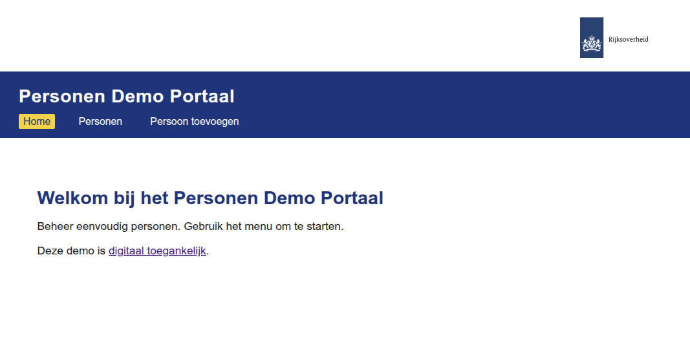

<h1>Vibe coding on Excalidraw (e8w)</h1>

Only this section is maintained manually.

The rest of this repo is maintained by "vibe coding" in the Cursor IDE.

Based on this e8w model:


Resulting in this webapp:



As of here ... vibe-coded !

# Person Web App (Flask + Vue)

## Structure
- `backend/` — Flask + SQLAlchemy API
- `frontend/` — Vue 3 app

## Quickstart

### 1. Backend
```
cd backend
pip install -r requirements.txt
python app.py
```
API: http://localhost:5000

### 2. Frontend
```
cd frontend
npm install
npm run serve
```
App: http://localhost:8080

## Features
- List, add, and edit persons
- Test data: Alice, Bob, Charlie