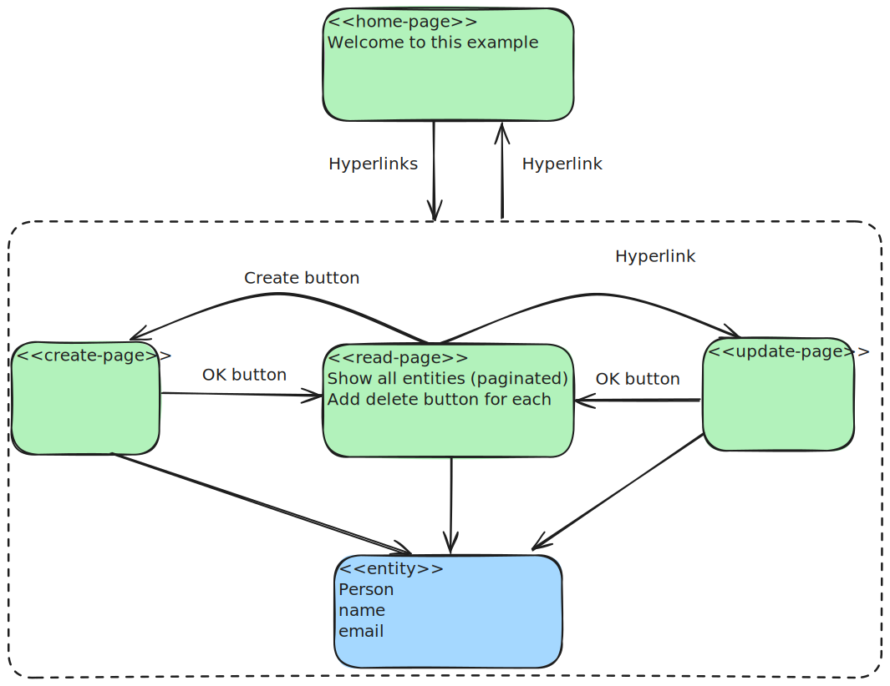
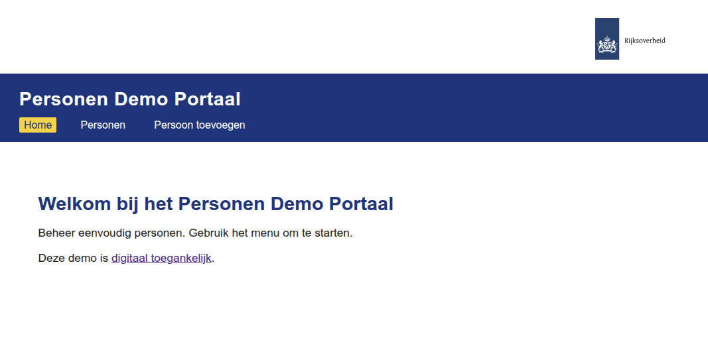
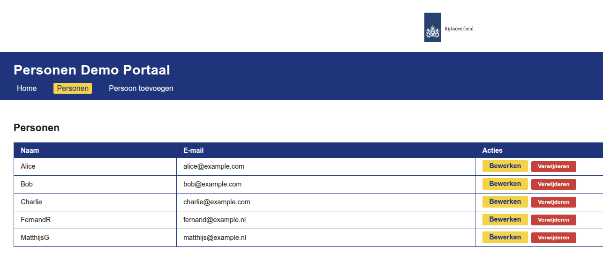
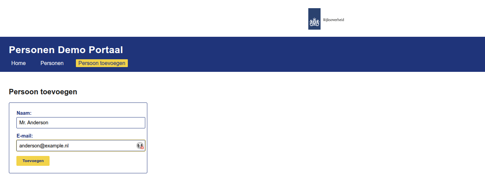
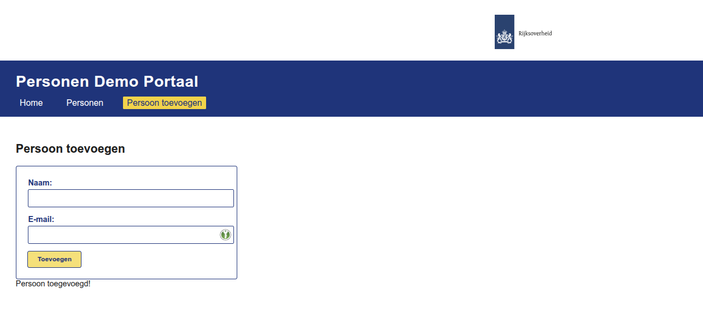
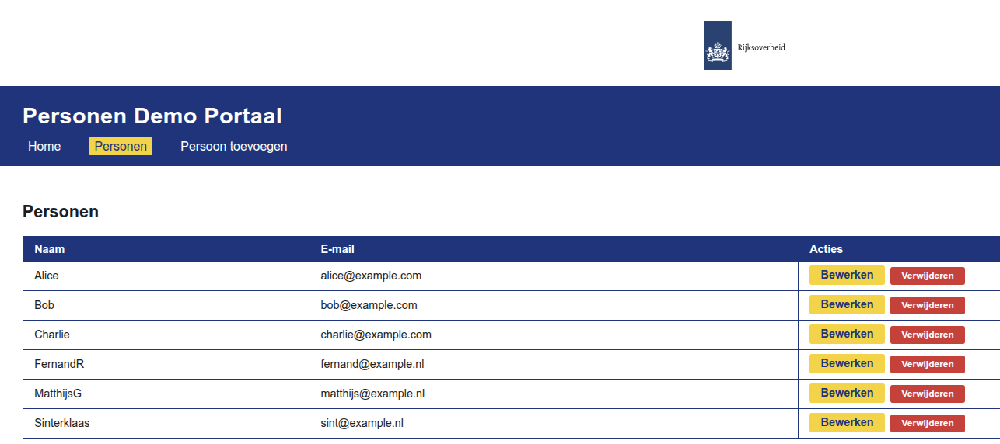

Develop a basic CRUD application:

- Using a draft Excalidraw model as a starting point
- Applying an interactive chat in Cursor IDE ("vibe coding")
- Safeguarding intermediate milestones in the Git repo

Only this section and the below images are manually.

- The rest of this repo was edited by the Cursor IDE's LLMs

This draft model has been taken as a starting point:



Resulting in this webapp (after a couple of small iterations):











# Person Web App (Flask + Vue)

## Structure
- `backend/` — Flask + SQLAlchemy API
- `frontend/` — Vue 3 app

## Quickstart

### 1. Backend
```
cd backend
pip install -r requirements.txt
python app.py
```
API: http://localhost:5000

### 2. Frontend
```
cd frontend
npm install
npm run serve
```
App: http://localhost:8080

## Features
- List, add, and edit persons
- Test data: Alice, Bob, Charlie