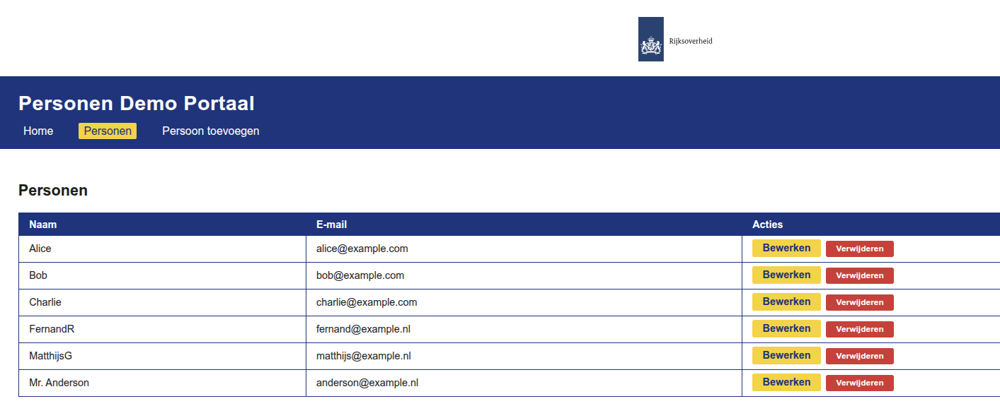

<h1>Draft vibe coding on Excalidraw (e8w)</h1>

This section is maintained manually.

- The rest of this repo is maintained by "vibe coding" in the Cursor IDE
- Based on this intial model:


- Resulting in this webapp (after some iterations):




# Person Web App (Flask + Vue)

## Structure
- `backend/` — Flask + SQLAlchemy API
- `frontend/` — Vue 3 app

## Quickstart

### 1. Backend
```
cd backend
pip install -r requirements.txt
python app.py
```
API: http://localhost:5000

### 2. Frontend
```
cd frontend
npm install
npm run serve
```
App: http://localhost:8080

## Features
- List, add, and edit persons
- Test data: Alice, Bob, Charlie